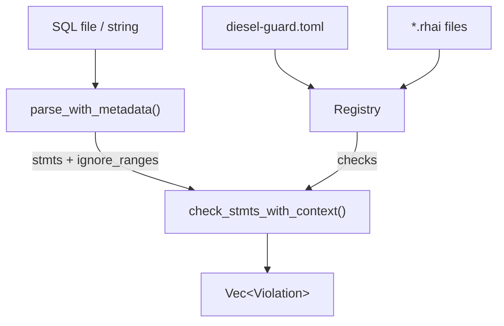
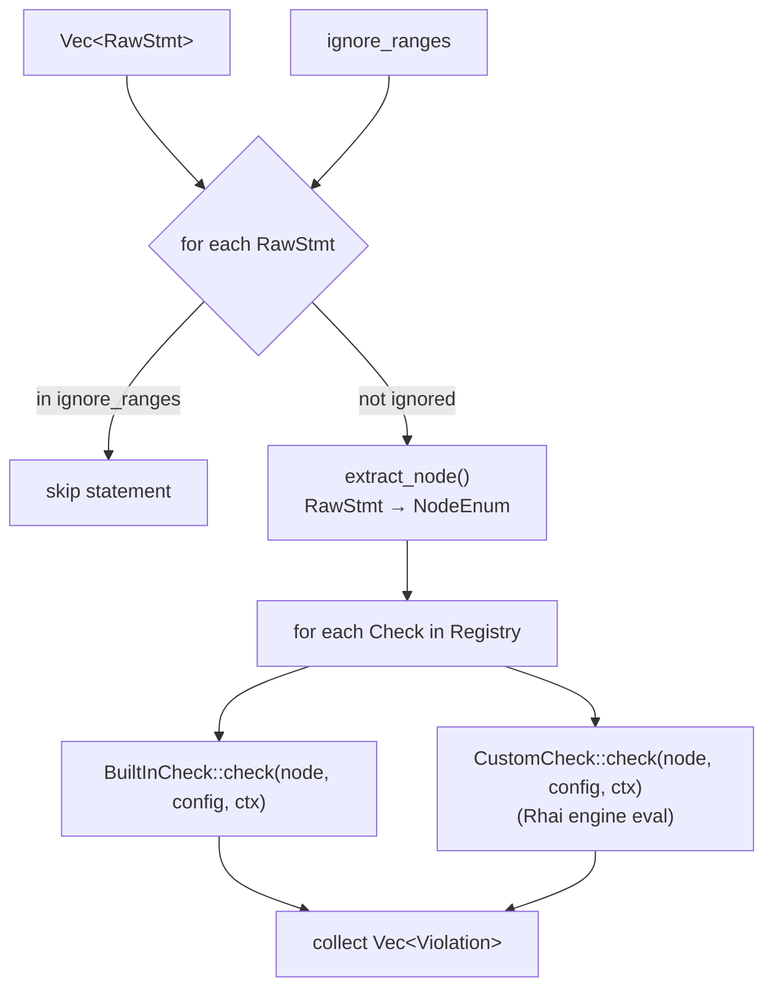
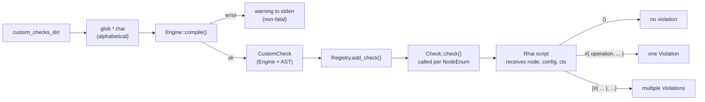

# Contributing to Diesel Guard 🐘💨

Thank you for your interest in contributing! Whether you're fixing a bug, adding a check, or writing a custom rule, this document is your map.

## Architecture

### System Overview



### Check Execution Loop



### Custom Check Loading




## How Checks Work

The Registry calls every check on each parsed SQL statement. A check receives a `NodeEnum` — one variant per SQL statement type — and returns a list of violations (empty means safe).

The pattern is always the same: bail early if the node is not the type you care about, then inspect the node and return violations.

**Simple check** (non-ALTER TABLE):

```rust
pub struct AddIndexCheck;

impl Check for AddIndexCheck {
    fn check(&self, node: &NodeEnum, _config: &Config, _ctx: &MigrationContext) -> Vec<Violation> {
        let NodeEnum::IndexStmt(stmt) = node else {
            return vec![];  // not a CREATE INDEX — ignore
        };

        if stmt.concurrent {
            return vec![];  // CONCURRENTLY — safe
        }

        vec![Violation::new("ADD INDEX without CONCURRENTLY", "...", "...")]
    }
}
```

**ALTER TABLE check** — never match `AlterTableStmt` directly; use `alter_table_cmds()` which extracts the table name and individual commands for you:

```rust
impl Check for AddColumnCheck {
    fn check(&self, node: &NodeEnum, config: &Config, _ctx: &MigrationContext) -> Vec<Violation> {
        let Some((table_name, cmds)) = alter_table_cmds(node) else {
            return vec![];
        };

        cmds.iter()
            .filter_map(|cmd| {
                let col = cmd_def_as_column_def(cmd)?;  // is this ADD COLUMN?

                if !column_has_constraint(col, ConstrType::ConstrDefault as i32) {
                    return None;
                }

                // Version-aware: constant defaults are safe on PG 11+
                if config.postgres_version >= Some(11) && is_constant_default(col) {
                    return None;
                }

                Some(Violation::new("ADD COLUMN with DEFAULT", "...", "..."))
            })
            .collect()
    }
}
```

Use `_config` when the check has no version-specific logic; use `config` when it does. Use `_ctx` when the check does not inspect transaction context; use `ctx` when it does (currently only `AddIndexCheck`, `DropIndexCheck`, `ReindexCheck`). Compare `config.postgres_version >= Some(N)` — `None` means unknown, so the safe path is to flag the violation.

**Watch out:** `ALTER TABLE ... RENAME COLUMN/TO` is parsed as `RenameStmt`, not `AlterTableStmt`. It will never appear in `alter_table_cmds()` — match on `NodeEnum::RenameStmt` directly and use `rename_type` to distinguish column from table renames.

**pg_query v6 quirks:** SERIAL/BIGSERIAL/SMALLSERIAL are preserved as type names (not desugared to int+nextval). Protobuf fields with value 0 may be omitted entirely — match on node type presence rather than `subtype == 0`. `use pg_query::protobuf::*` shadows `std::string::String`, so use explicit imports when both are needed.

### pg_helpers

`src/checks/pg_helpers.rs` has helpers for navigating the AST: extracting table names, unwrapping ALTER TABLE commands, inspecting column definitions, testing types, and so on. Before writing raw protobuf traversal in a new check, look here — the helper you need likely already exists.

Use `diesel-guard dump-ast --sql "..."` to inspect what AST a statement produces and find which fields to check.

## Adding a New Check

1. **Create** `src/checks/your_check.rs` — implement the `Check` trait. Use `_config` if unused, `config` if version-aware. Use `_ctx` if unused, `ctx` if the check needs to know whether the migration runs inside a transaction (e.g. for CONCURRENTLY operations). Add `#[cfg(test)]` unit tests using the macros above.
2. **Register** in `src/checks/mod.rs` — add `mod`, `pub use`, and `self.register_check(config, YourCheck)` call inside `Registry::with_config()` (all alphabetically). Check names are derived from struct names automatically. (`register_check` is the private built-in registration path; `add_check` is the public API used only for custom Rhai checks.)
3. **Create fixtures** — `tests/fixtures/your_operation_{safe,unsafe}/up.sql`. First line MUST be `-- Safe: ...` or `-- Unsafe: ...`.
4. **Update integration tests** in `tests/fixtures_test.rs` — add to `safe_fixtures` vec, add detection test, update `test_check_entire_fixtures_directory` counts.
5. **Update docs** — create `docs/src/checks/<check>.md` with bad/good examples and add entry to `docs/src/SUMMARY.md`.
6. **Verify** — `just check` (fast gate) then `just ci` (full pipeline)

### Naming Conventions

- **Check structs**: `YourOperationCheck`
- **Tests**: `test_detects_*` (violation found), `test_allows_*` (safe variant), `test_ignores_*` (unrelated operation)
- **Fixtures**: `{operation}_{safe|unsafe}` or `{operation}_{variant}_{safe|unsafe}`

## Custom Rhai Checks

Users place `.rhai` files in a directory and set `custom_checks_dir` in `diesel-guard.toml`.

- Each script receives a `node` variable (pg_query AST node serialized via `rhai::serde::to_dynamic()`), a `config` variable (current config settings), and a `ctx` variable (per-migration metadata: `ctx.run_in_transaction`, `ctx.no_transaction_hint`).
- Scripts access fields like `node.IndexStmt.concurrent`, `node.CreateStmt.relation.relname`; access config like `config.postgres_version` (integer or `()` when unset); access migration context like `ctx.run_in_transaction` (bool) and `ctx.no_transaction_hint` (string)
- Return protocol: `()` = no violation, `#{ operation, problem, safe_alternative }` = one violation, array of maps = multiple
- Check name = filename stem (e.g., `require_concurrent.rhai` → `require_concurrent`); disableable via `disable_checks`
- Safety-assured blocks automatically skip custom checks (same `check_stmts_with_context` path)
- Engine limits: `max_operations(100_000)`, `max_string_size(10_000)`, `max_array_size(1_000)`, `max_map_size(1_000)`
- Runtime errors and invalid return values are logged as warnings to stderr, never panic
- `load_custom_checks()` is non-fatal: compilation errors become warnings; scripts load in alphabetical order

Use `diesel-guard dump-ast --sql "..."` to inspect the AST structure for a statement. Output strips the outer `RawStmt`/`Node` wrappers — the JSON starts directly at the concrete node type (e.g. `{"IndexStmt": {...}}`), matching what a Rhai script receives as `node`.

Reference scripts in `examples/`: `no_unlogged_tables.rhai`, `require_concurrent_index.rhai`, `require_if_exists_on_drop.rhai`, `no_truncate_in_production.rhai`, `limit_columns_per_index.rhai`, `require_index_name_prefix.rhai`

### `pg` Constants Module

Scripts can reference pg_query protobuf enum values via the `pg::` prefix (e.g. `pg::OBJECT_INDEX`, `pg::AT_DROP_COLUMN`, `pg::CONSTR_PRIMARY`) instead of raw integers. See `src/scripting.rs` for the full list.

## Configuration Reference (`diesel-guard.toml`)

- **`framework`** (required): `"diesel"` or `"sqlx"`. Case-sensitive. Default (when no config file): `"diesel"`.
- **`start_after`** (optional): Timestamp to skip older migrations. Accepts `YYYYMMDDHHMMSS`, `YYYY_MM_DD_HHMMSS`, or `YYYY-MM-DD-HHMMSS`. Separators are normalized before comparison.
- **`check_down`** (optional, default `false`): Include down/rollback migration files in checks.
- **`disable_checks`** (optional): List of check names to skip. Unknown names produce a warning (not an error). Mutually exclusive with `enable_checks`.
- **`enable_checks`** (optional): Whitelist — only these checks run. Mutually exclusive with `disable_checks`; setting both is a `ConfigError`.
- **`postgres_version`** (optional): Target Postgres major version as integer (e.g., `16`). Used by version-aware checks.
- **`custom_checks_dir`** (optional): Path to directory containing `.rhai` script files for custom checks.

## Testing

```bash
# Run all tests
cargo test

# Unit tests only
cargo test --lib

# Integration tests only (fixtures)
cargo test --test fixtures_test

# Tests for a specific check
cargo test add_column
```

**Unit tests** live in `src/checks/*.rs`. Each check module has its own suite using the macros from `src/checks/test_utils.rs`:

```rust
assert_detects_violation!(Check, sql, "OPERATION NAME")           // exactly 1 violation
assert_detects_violation_with_config!(Check, sql, "OP", config)   // same, with explicit config
assert_detects_violation_containing!(Check, sql, "OP", "substr")  // violation problem contains substring
assert_detects_n_violations!(Check, sql, n, "OPERATION NAME")     // exactly N violations
assert_allows!(Check, sql)                                         // no violations
assert_allows_with_config!(Check, sql, config)                     // no violations with explicit config
```

All macros pass `MigrationContext::default()` (`run_in_transaction: true`). For checks that are context-aware (currently `AddIndexCheck`, `DropIndexCheck`, `ReindexCheck`), call `check()` directly with an explicit `MigrationContext` when testing the no-transaction path:

```rust
let ctx = MigrationContext { run_in_transaction: false, no_transaction_hint: "" };
let violations = AddIndexCheck.check(&node, &Config::default(), &ctx);
assert!(violations.is_empty());
```

**Integration tests** in `tests/fixtures_test.rs` run `SafetyChecker` against real `.sql` files under `tests/fixtures/`. Each fixture is a directory containing an `up.sql` whose first line declares its intent:

```
-- Safe: Create index with CONCURRENTLY
CREATE INDEX CONCURRENTLY idx_users_email ON users(email);
```

```
-- Unsafe: Create index without CONCURRENTLY
CREATE INDEX idx_users_email ON users(email);
```

The test suite has three layers:

1. **`test_safe_fixtures_pass`** — runs all safe fixtures and asserts zero violations. Add your safe fixture name to this list.
2. **Per-check detection tests** (e.g. `test_add_index_without_concurrently_detected`) — load the unsafe fixture and assert the expected operation name and violation count. Add one test per unsafe fixture.
3. **`test_check_entire_fixtures_directory`** — scans the whole `tests/fixtures/` directory and asserts exact totals: number of files with violations and total violation count. Update both numbers when adding fixtures. Some fixtures produce multiple violations because multiple checks fire on the same statement (e.g. an unnamed UNIQUE constraint triggers both `AddUniqueConstraintCheck` and `UnnamedConstraintCheck`); the assertion message documents the current breakdown.

## Code Quality

This project uses [just](https://github.com/casey/just) as a task runner. Install it with `brew install just` or `cargo install just`.

Run before submitting:

```bash
just ci
```

This mirrors the CI pipeline exactly: clippy, format check, doc check, dependency audit, release build, tests, and security audit. All steps must pass for a PR to merge.

For a faster pre-commit gate (format check + clippy + unit tests only):

```bash
just check
```

Install required tools if you haven't already:

```bash
just install-tools
```

## Contributing Process

### Reporting Bugs

Before reporting:
1. Search [existing issues](https://github.com/ayarotsky/diesel-guard/issues)
2. Test against the latest version from the main branch
3. Verify the issue is reproducible

Include: exact SQL or migration file, expected vs actual behavior, `diesel-guard --version` and `rustc --version`, full error messages / backtraces.

### Suggesting New Checks

Check the [open issues tagged `new check`](https://github.com/ayarotsky/diesel-guard/issues?q=is%3Aissue+label%3A%22new+check%22) first to avoid duplicates. Open an issue with `[Check]` in the title (e.g., `[Check] REFRESH MATERIALIZED VIEW without CONCURRENTLY`). Include: the unsafe operation, why it's dangerous, the safe alternative, and any Postgres version specifics.

### Pull Requests

1. **Open an issue first** for significant changes to discuss the approach
2. **One check per PR** — makes review faster
3. Follow existing patterns — look at similar checks for guidance
4. Use descriptive commit messages referencing issue numbers where applicable
5. Fill out the PR template checklist before submitting

